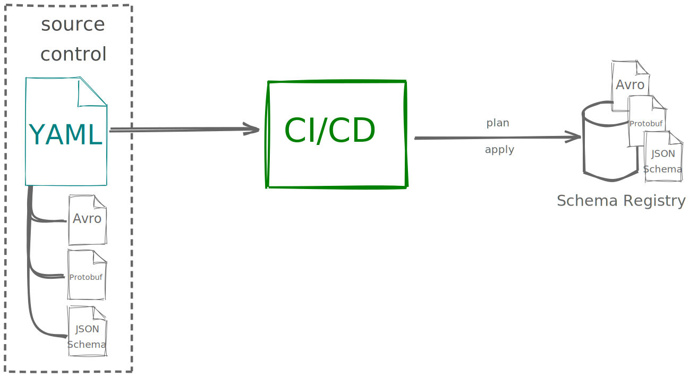

# schema-registry-gitops

[](https://github.com/domnikl/schema-registry-gitops/actions)
[](https://hub.docker.com/repository/docker/domnikl/schema-registry-gitops)
<a href="https://codeclimate.com/github/domnikl/schema-registry-gitops/maintainability"></a>
[](LICENSE)

Manages subjects, compatibility levels and schema registration for [Confluent Schema Registry](https://docs.confluent.io/platform/current/schema-registry/index.html) through applying a desired state file.

## Overview

Schema Registry GitOps is an Infrastructure as Code tool that applies a desired state configured through simple YAML and
Avro/Protobuf/JSON Schema files to a schema registry. That way you can keep a version control history of your
schemas and use all your favorite tools to validate, review, merge and evolve schemas in your CI/CD pipeline.



## Usage

```
Usage: schema-registry-gitops [-hvV] [--properties=<propertiesFilePath>]
                              [-r=<baseUrl>] [COMMAND]
Manages schema registries through Infrastructure as Code
  -h, --help                 Show this help message and exit.
      --properties=<propertiesFilePath>
                             a Java Properties file for client configuration
                               (optional)
  -r, --registry=<baseUrl>   schema registry endpoint, overwrites 'schema.
                               registry.url' from properties, can also be a
                               list of urls separated by comma
  -v, --verbose              enable verbose logging
  -V, --version              Print version information and exit.
Commands:
  help   Displays help information about the specified command
  plan   validate and plan schema changes, can be used to see all pending
           changes
  apply  applies the state to the given schema registry
  dump   prints the current state
```

In order to get help for a specific command, try `schema-registry-gitops <command> -h`.

## Running in Docker

`schema-registry-gitops` is available through [Docker Hub](https://hub.docker.com/repository/docker/domnikl/schema-registry-gitops), so running it in a container is as easy as:

```sh
docker run -v "$(pwd)/examples":/data domnikl/schema-registry-gitops plan --properties /data/client.properties /data/schema-registry.yml
```

Please keep in mind that using a tagged release may be a good idea.

## State file

The desired state is managed using this YAML schema:

```yaml
# sets global compatibility level (optional)
compatibility: FULL_TRANSITIVE
subjects:
  # a subject that links to a file for the schema definition
  - name: my-new-subject-referencing-a-schema-file
    # sets compatibility level for this subject (optional)
    compatibility: BACKWARD
    # file paths are always relative to the given (this) YAML file
    file: my-actual-schema.avsc
    # AVRO is the default type and can safely be omitted (only available for Schema Registry >= 5.5)
    type: AVRO
    # (optional) list of references for this subject
    # please note that these must be present in the registry before they can be referenced here 
    references:
      # name including the namespace, should be the same as the `type` being used in AVRO
      - name: dev.domnikl.schema-registry-gitops.User
        # subject name this schema is registered with in the registry
        subject: User-value
        # version of the referenced schema
        version: 1

  # another example: instead of referencing a file, it is also possible
  # to define the schema directly here, which is Protocol Buffers here (note explicit type here)
  - name: my-new-inline-schema-subject
    schema: 'syntax = "proto3";
        package com.acme;
        
        message OtherRecord {
          int32 an_id = 1;
        }'
    type: PROTOBUF
```

### compatibility

Supported `compatibility` values are:
* `NONE`
* `FORWARD`
* `BACKWARD`
* `FULL`
* `FORWARD_TRANSITIVE`
* `BACKWARD_TRANSITIVE`
* `FULL_TRANSITIVE`

### file, schema

Either one of `file` (recommended) or `schema` must be set. The former contains a path to a schema file while the latter can be set
to a string containing the schema.

### type

Supported `type` values are:

* `AVRO`
* `PROTOBUF`
* `JSON`

_Please note that `PROTOBUF` and `JSON` are only supported for Schema Registry >= 5.5, versions prior to that only support `AVRO`._

### references

[References to other schemas](https://docs.confluent.io/platform/current/schema-registry/serdes-develop/index.html#referenced-schemas) 
are being configured here as an optional list of references. `name`, `subject` and `version` need to be configured for
this to work. Also note that referenced schemas need to be present in the schema registry by the time that 
`schema-registry-gitops` runs.

## Configuration .properties

Configuration properties are being used to connect to the Schema Registry. The most common use case to use them
instead of just supplying `--registry` is to use SSL. The example below uses client certificates authentication.

```properties
schema.registry.url=https://localhost:8081
security.protocol=SSL
schema.registry.ssl.truststore.location=truststore.jks
schema.registry.ssl.truststore.password=<secret>
schema.registry.ssl.keystore.location=keystore.jks
schema.registry.ssl.keystore.password=<secret>
schema.registry.ssl.key.password=<secret>
```

## Environment variables

Env variables prefixed with `SCHEMA_REGISTRY_GITOPS_` can be provided for configuration and will also be forwarded
to configure the schema registry client being used. This example uses the same settings above.

```sh
SCHEMA_REGISTRY_GITOPS_SCHEMA_REGISTRY_URL=https://localhost:8081
SCHEMA_REGISTRY_GITOPS_SECURITY_PROTOCOL=SSL
SCHEMA_REGISTRY_GITOPS_SCHEMA_REGISTRY_SSL_TRUSTSTORE_LOCATION=truststore.jks
SCHEMA_REGISTRY_GITOPS_SCHEMA_REGISTRY_SSL_TRUSTSTORE_PASSWORD=<secret>
SCHEMA_REGISTRY_GITOPS_SCHEMA_REGISTRY_SSL_KEYSTORE_LOCATION=keystore.jks
SCHEMA_REGISTRY_GITOPS_SCHEMA_REGISTRY_SSL_KEYSTORE_PASSWORD=<secret>
SCHEMA_REGISTRY_GITOPS_SCHEMA_REGISTRY_SSL_KEY_PASSWORD=<secret>
```

## Deleting subjects ⚠️

Subjects no longer listed in the State file but present in the registry will not be deleted by default. To enable full
sync between the two, use either `-d` or `--enable-deletes` in `plan` and `apply` modes.

## Development

Docker is used to build and test `schema-registry-gitops` for development.

```sh
# test & build
docker build -t domnikl/schema-registry-gitops .

# run it in Docker
docker run -v ./examples:/data domnikl/schema-registry-gitops plan --registry http://localhost:8081 /data/schema-registry.yml
```

## Acknowledgement

Schema Registry GitOps was born late in 2020 while being heavily inspired by [Shawn Seymour](https://github.com/devshawn) and his excellent [kafka-gitops](https://github.com/devshawn/kafka-gitops)! Much ❤ to [Confluent](https://www.confluent.io/) for building Schema Registry and an amazing client lib, I am really just standing on the shoulders of giants here.
